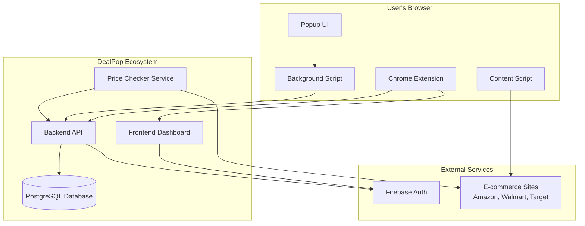
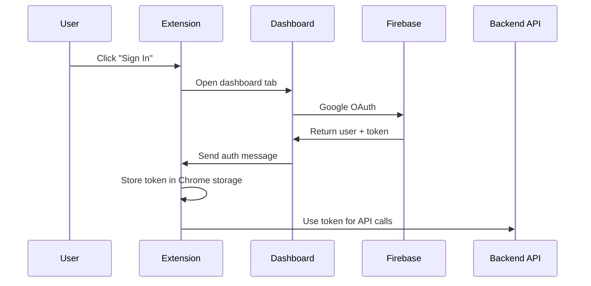
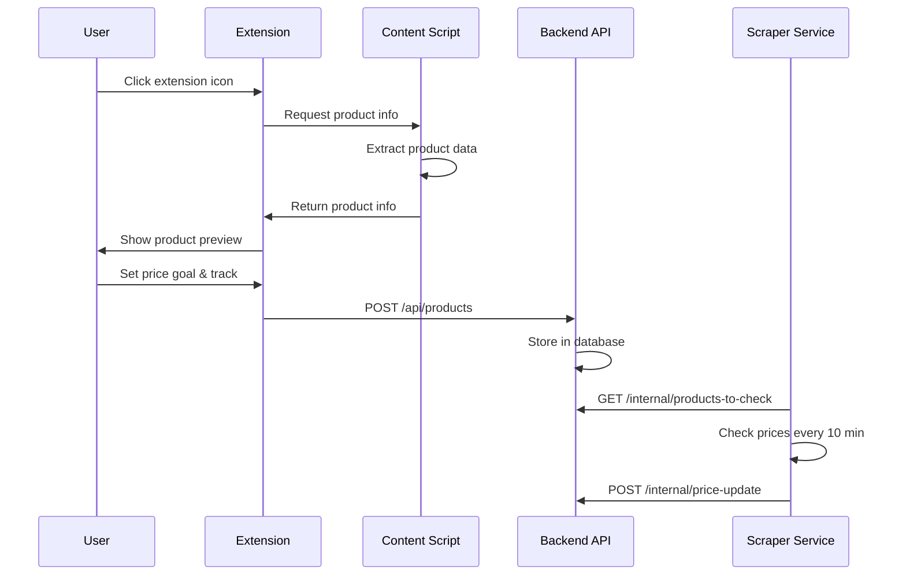

# DealPop Chrome Extension Architecture

## Overview

The DealPop Chrome Extension is a browser extension that enables users to track product prices across e-commerce websites. It integrates with the DealPop ecosystem through the backend API, frontend dashboard, and price checking service.

## System Architecture



## Extension Components

### 1. Content Script (`src/content/content.ts`)
- **Purpose**: Extracts product information from e-commerce websites
- **Injection**: Runs on all URLs (`<all_urls>`)
- **Key Features**:
  - Product title, price, and image extraction
  - Variant detection (color, size, capacity)
  - Multi-retailer support (Amazon, Walmart, Target)
  - Structured data parsing (JSON-LD, Open Graph)
  - Dynamic content handling

### 2. Background Script (`src/background/index.ts`)
- **Purpose**: Service worker for extension lifecycle and API communication
- **Key Features**:
  - Message handling between popup and content script
  - API communication with backend
  - Authentication token management
  - Product tracking requests

### 3. Popup UI (`src/popup/App.tsx`)
- **Purpose**: User interface for extension interaction
- **Technology**: React 18 with TypeScript and Tailwind CSS
- **Key Features**:
  - Authentication status display
  - Product information preview
  - Price goal setting
  - Tracking confirmation
  - Error handling and user feedback

### 4. Configuration (`src/config/`)
- **API Configuration** (`api.ts`): Backend API endpoints and URLs
- **Extension Configuration** (`extension.ts`): Extension settings and feature flags
- **Firebase Configuration** (`firebase.ts`): Authentication settings

## Data Flow

### 1. User Authentication Flow



### 2. Product Tracking Flow



## Technology Stack

### Frontend Technologies
- **React 18.2.0**: UI framework for popup interface
- **TypeScript**: Type-safe development
- **Tailwind CSS**: Utility-first styling
- **Vite**: Build tool and development server

### Chrome Extension APIs
- **Chrome Extensions Manifest V3**: Latest extension standard
- **Chrome Runtime API**: Message passing and lifecycle
- **Chrome Storage API**: Persistent data storage
- **Chrome Tabs API**: Tab management for authentication

### Integration Technologies
- **Firebase Auth**: User authentication via Google OAuth
- **REST API**: Communication with backend services
- **Chrome Messaging**: Extension-to-dashboard communication

## File Structure

```
src/
├── background/           # Service worker
│   ├── index.ts         # Main background script
│   ├── messageHandlers.ts # Message handling logic
│   ├── priceUtils.ts    # Price processing utilities
│   └── state.ts         # Extension state management
├── content/             # Content script
│   └── content.ts       # Product extraction logic
├── popup/               # User interface
│   ├── App.tsx          # Main popup component
│   ├── index.html       # Popup HTML template
│   ├── index.css        # Global styles
│   └── main.tsx         # React entry point
├── services/            # Business logic
│   ├── apiClient.ts     # Backend API communication
│   └── auth.ts          # Authentication service
└── config/              # Configuration
    ├── api.ts           # API endpoints
    ├── extension.ts     # Extension settings
    └── firebase.ts      # Firebase configuration
```

## Integration Points

### Backend API Integration
The extension communicates with the DealPop backend API for:
- **Product Tracking**: `POST /api/products` - Store tracked products
- **User Management**: Authentication via Firebase JWT tokens
- **Data Retrieval**: `GET /api/products` - Load user's tracked products

### Frontend Dashboard Integration
The extension integrates with the DealPop dashboard for:
- **Authentication**: Dashboard handles Google OAuth flow
- **User Experience**: Seamless sign-in experience
- **Message Passing**: Chrome runtime messaging for auth data

### Price Checker Service Integration
The extension enables price monitoring through:
- **Product Registration**: Products tracked via extension are monitored by scraper
- **Price Updates**: Scraper updates prices every 10 minutes
- **Alert System**: Users receive notifications when prices drop

## Security Considerations

### Content Security Policy (CSP)
- **Extension Pages**: `script-src 'self'; object-src 'self'`
- **No Inline Scripts**: All code must be in separate files
- **No Remote Code**: No dynamic script loading

### Authentication Security
- **Firebase JWT Tokens**: Industry-standard authentication
- **Token Storage**: Secure storage in Chrome's local storage
- **Token Refresh**: Automatic token renewal before expiration
- **CORS Protection**: Proper origin validation

### Data Privacy
- **Local Storage**: User data stored locally in browser
- **No Data Collection**: Extension doesn't collect personal data
- **Secure Communication**: All API calls use HTTPS

## Performance Optimizations

### Content Script Efficiency
- **Lazy Loading**: Content script only runs when needed
- **Selector Optimization**: Efficient DOM queries for product data
- **Caching**: Variant information cached to avoid re-extraction
- **Debounced Operations**: Prevents excessive API calls

### Bundle Optimization
- **Code Splitting**: Separate bundles for different contexts
- **Tree Shaking**: Remove unused code from bundles
- **Minification**: Production builds are minified
- **Source Maps**: Development builds include source maps

## Browser Compatibility

### Supported Browsers
- **Chrome**: Primary target (Manifest V3)
- **Edge**: Compatible (Chromium-based)
- **Opera**: Compatible (Chromium-based)

### Chrome Web Store Requirements
- **Manifest V3**: Latest extension standard
- **No Remote Code**: All code must be bundled
- **Proper Permissions**: Minimal required permissions
- **Privacy Policy**: Required for data handling

## Development Workflow

### Local Development
1. **Build Extension**: `npm run build`
2. **Load in Chrome**: Load unpacked from `dist/` folder
3. **Watch Mode**: `npm run build:watch` for auto-rebuild
4. **Testing**: Test on various e-commerce sites

### Production Deployment
1. **Build Production**: `npm run build:prod`
2. **Package Extension**: Create zip file from `dist/`
3. **Chrome Web Store**: Upload for review
4. **Version Management**: Update version in manifest.json

## Monitoring and Debugging

### Development Tools
- **Chrome DevTools**: Debug popup and content scripts
- **Extension Console**: Background script debugging
- **Network Tab**: Monitor API calls
- **Storage Tab**: Inspect Chrome storage

### Production Monitoring
- **Console Logging**: Structured logging for debugging
- **Error Tracking**: Comprehensive error handling
- **Performance Metrics**: Track extension performance
- **User Feedback**: Error reporting mechanisms

## Future Enhancements

### Planned Features
- **Multi-retailer Support**: Expand to more e-commerce sites
- **Advanced Variants**: Better variant detection
- **Price History**: Visual price tracking
- **Notifications**: Browser notification support

### Technical Improvements
- **Offline Support**: Cache product data locally
- **Performance**: Optimize content script execution
- **Accessibility**: Improve screen reader support
- **Internationalization**: Multi-language support

---

*This architecture document focuses on the Chrome Extension component of the DealPop ecosystem. For information about other components, see the respective repository documentation.*
