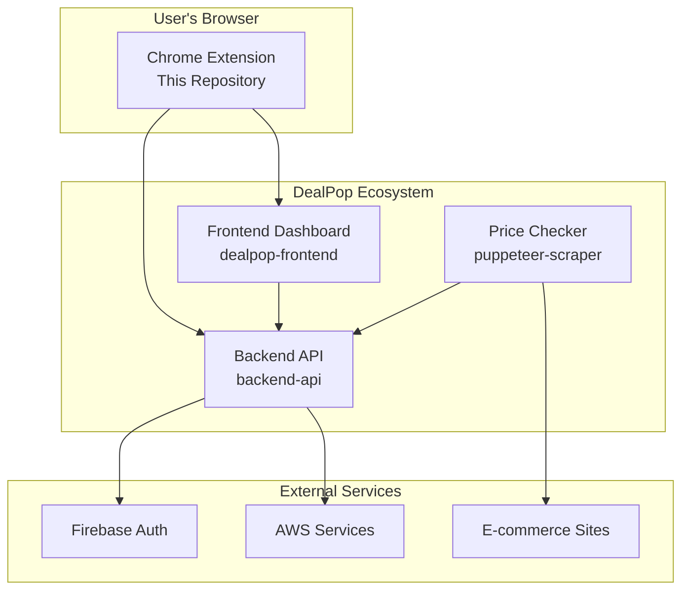

# DealPop Chrome Extension

[](https://github.com/your-org/deal-pop-chrome-extension)
[](LICENSE)
[](https://chrome.google.com/webstore)

DealPop is a Chrome extension that helps you save money by automatically tracking product prices on e-commerce websites. Simply click the extension while shopping on Amazon, Walmart, or Target to start tracking any product and get notified when prices drop to your target price.

## 🚀 Quick Start

### For Users
1. **Install**: Download from Chrome Web Store (coming soon)
2. **Sign In**: Create your DealPop account
3. **Shop**: Browse products on Amazon, Walmart, or Target
4. **Track**: Click the DealPop icon and set your target price
5. **Save**: Get notified when prices drop!

### For Developers
```bash
# Clone and install
git clone <repository-url>
cd chrome-extension
npm install

# Build and test
npm run build
# Load dist/ folder in Chrome Extensions page
```

## ✨ Features

- **🛍️ Multi-Retailer Support**: Works on Amazon, Walmart, Target, and more
- **🎯 Smart Price Tracking**: Set target prices and get notified when they drop
- **📱 Easy-to-Use Interface**: Simple popup for quick product tracking
- **🔐 Secure Authentication**: Google OAuth integration via Firebase
- **📊 Price History**: Track price trends over time
- **🔔 Email Notifications**: Get alerted when prices hit your targets
- **🎨 Modern UI**: Built with React and Tailwind CSS

## 🏗️ Architecture

DealPop consists of four interconnected components:



## 📚 Documentation

### For Everyone
- **[Non-Technical Overview](docs/NON_TECHNICAL_OVERVIEW.md)** - What DealPop does in plain English
- **[Architecture Overview](ARCHITECTURE.md)** - How all components work together
- **[Known Issues](docs/KNOWN_ISSUES.md)** - Current limitations and planned improvements

### For Developers
- **[Developer Setup](docs/DEVELOPER_SETUP.md)** - Complete local development guide
- **[API Documentation](docs/api/)** - Backend API specification and examples
- **[Repository Integration](docs/integration/REPOSITORY_INTEGRATION.md)** - How this extension integrates with other repos
- **[API Usage Guide](docs/integration/API_USAGE.md)** - How the extension uses the backend API

### For Troubleshooting
- **[Troubleshooting Guide](docs/TROUBLESHOOTING.md)** - Common issues and solutions

## 🛠️ Technology Stack

- **Frontend**: React 18, TypeScript, Tailwind CSS
- **Build Tool**: Vite
- **Chrome APIs**: Manifest V3, Service Worker, Content Scripts
- **Authentication**: Firebase Auth with Google OAuth
- **Backend Integration**: REST API with JWT tokens
- **Testing**: Jest, TypeScript

## 🚀 Development

### Prerequisites
- Node.js 18+
- Chrome browser
- Git

### Quick Development Setup
```bash
# Install dependencies
   npm install

# Start watch mode for auto-rebuild
npm run build:watch

# Load extension in Chrome:
# 1. Go to chrome://extensions/
# 2. Enable "Developer mode"
# 3. Click "Load unpacked" and select the 'dist/' folder
```

### Available Scripts
```bash
npm run build          # Development build with source maps
npm run build:prod     # Production build (minified)
npm run build:watch    # Watch mode for development
npm run test           # Run tests
npm run type-check     # TypeScript type checking
npm run clean          # Clean build directory
```

## 🔧 Configuration

### Environment Variables
Create a `.env` file for local development:
```bash
VITE_API_BASE_URL=http://localhost:3000
VITE_DASHBOARD_URL=http://localhost:5173/beta/login?extension=true
VITE_EXTENSION_DEBUG=true
```

### API Endpoints
The extension communicates with the DealPop backend API:
- **Product Tracking**: `POST /api/products`
- **User Management**: Firebase JWT authentication
- **Price Monitoring**: Handled by separate price checker service

## 🧪 Testing

### Unit Tests
```bash
npm test                # Run all tests
npm run test:watch      # Watch mode
npm run test:coverage   # Coverage report
```

### Manual Testing
```bash
npm run test:extraction  # Test product extraction
npm run test:sites      # Test on different sites
```

### Integration Testing
1. Start backend API locally (`npm run dev` in backend-api repo)
2. Start frontend dashboard locally (`npm run dev` in dealpop-frontend repo)
3. Build and load extension
4. Test complete user flow

## 📦 Deployment

### Chrome Web Store
1. **Build Production**: `npm run build:prod`
2. **Package**: Create zip file from `dist/` folder
3. **Submit**: Upload to Chrome Web Store for review
4. **Publish**: Release to users after approval

### Prerequisites for Store Submission
- [ ] All tests pass
- [ ] Production build successful
- [ ] No console errors
- [ ] Privacy policy created
- [ ] Store assets prepared (icons, screenshots)
- [ ] Extension ID added to dashboard configuration

## 🔒 Security

- **Content Security Policy**: Strict CSP to prevent XSS
- **Firebase Authentication**: Industry-standard JWT tokens
- **HTTPS Only**: All communications encrypted
- **No Remote Code**: All code bundled in extension
- **Minimal Permissions**: Only necessary Chrome permissions

## 🤝 Contributing

1. **Fork** the repository
2. **Create** a feature branch (`git checkout -b feature/amazing-feature`)
3. **Commit** your changes (`git commit -m 'Add amazing feature'`)
4. **Push** to the branch (`git push origin feature/amazing-feature`)
5. **Open** a Pull Request

### Development Guidelines
- Follow TypeScript best practices
- Write tests for new features
- Update documentation as needed
- Follow the existing code style
- Test on multiple retailer sites

## 📊 Project Status

### Current Status: MVP Development
- ✅ Core functionality implemented
- ✅ Multi-retailer support (Amazon, Walmart, Target)
- ✅ Firebase authentication
- ✅ Backend API integration
- ✅ Price tracking and alerts
- 🔄 Chrome Web Store submission (in progress)
- 🔄 Advanced variant detection
- 🔄 Performance optimizations

### Success Metrics
- **Product Extraction**: 80%+ success rate
- **Authentication**: 95%+ success rate
- **User Retention**: Target 70% (7-day)
- **Store Rating**: Target 4.5+ stars

## 🆘 Support

### Getting Help
- **Documentation**: Check the `docs/` folder for detailed guides
- **Issues**: Report bugs or request features via GitHub Issues
- **Email**: Contact support@dealpop.com

### Common Issues
- **Extension won't load**: Check [Troubleshooting Guide](docs/TROUBLESHOOTING.md)
- **Authentication problems**: Verify Firebase configuration
- **Product extraction fails**: Check [Known Issues](docs/KNOWN_ISSUES.md)

## 📄 License

This project is licensed under the MIT License - see the [LICENSE](LICENSE) file for details.

## 🙏 Acknowledgments

- **Chrome Extension APIs**: Google's comprehensive extension platform
- **Firebase**: Authentication and backend services
- **React & Vite**: Modern frontend development
- **Tailwind CSS**: Utility-first styling
- **AWS**: Reliable cloud infrastructure

---

**DealPop Chrome Extension** - Never miss a deal again! 🛒💰 