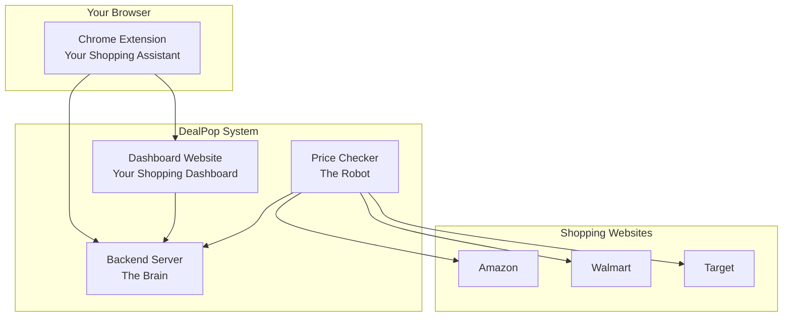

# DealPop Chrome Extension - Non-Technical Overview

## What is DealPop?

DealPop is a Chrome browser extension that helps you save money by automatically tracking product prices on online shopping websites. Think of it as your personal shopping assistant that watches for price drops and alerts you when items you want go on sale.

## How Does It Work?

### The Simple Version
1. **Install the Extension**: Add DealPop to your Chrome browser (like adding an app to your phone)
2. **Browse Products**: Shop normally on websites like Amazon, Walmart, or Target
3. **Track Products**: Click the DealPop button when you see something you want to buy
4. **Set Your Price**: Tell DealPop what price you're willing to pay
5. **Get Notified**: DealPop watches the price and emails you when it drops to your target price

### What Happens Behind the Scenes
- **Product Detection**: The extension automatically recognizes when you're looking at a product page
- **Price Monitoring**: Our system checks prices every 10 minutes, 24/7
- **Smart Alerts**: You get notified immediately when prices drop to your target
- **Data Storage**: Your tracked products are saved securely in your account

## The DealPop System

DealPop consists of four main parts that work together:

### 1. Chrome Extension (This Part)
**What it is**: A small program that runs in your Chrome browser
**What it does**: 
- Detects when you're shopping online
- Extracts product information (name, price, image)
- Lets you set price targets
- Connects you to your DealPop account

**Think of it as**: Your shopping assistant that lives in your browser

### 2. Dashboard Website
**What it is**: A website where you manage your tracked products
**What it does**:
- Shows all products you're tracking
- Lets you change price targets
- Displays price history and trends
- Manages your account settings

**Think of it as**: Your personal shopping dashboard

### 3. Backend Server
**What it is**: A computer server that stores and processes your data
**What it does**:
- Stores your tracked products
- Manages your account information
- Coordinates between all parts of the system
- Handles security and authentication

**Think of it as**: The brain that coordinates everything

### 4. Price Checker Service
**What it is**: An automated system that monitors prices
**What it does**:
- Checks prices every 10 minutes on all your tracked products
- Updates price information in real-time
- Triggers alerts when prices drop
- Sends you email notifications

**Think of it as**: A robot that never sleeps and always watches for deals

## How the Parts Work Together

## User Experience Flow

### When You Want to Track a Product

1. **You're Shopping**: Browsing Amazon, Walmart, or Target
2. **Extension Activates**: DealPop detects you're on a product page
3. **Product Info Appears**: Extension shows product name, current price, and image
4. **You Set Your Target**: Enter the price you want to pay
5. **Tracking Starts**: Product is added to your DealPop account
6. **Monitoring Begins**: Our robot starts checking the price every 10 minutes

### When a Price Drops

1. **Robot Detects Drop**: Price checker finds a lower price
2. **System Checks Target**: Compares new price to your target price
3. **Alert Triggered**: If price is at or below your target, alert is sent
4. **You Get Notified**: Receive email notification about the price drop
5. **You Decide**: Buy now or adjust your target price

## Supported Websites

### Currently Supported
- **Amazon**: Books, electronics, clothing, home goods, and more
- **Walmart**: Groceries, electronics, clothing, and household items
- **Target**: Clothing, home goods, electronics, and beauty products

### How We Add New Sites
- Our team analyzes each website's structure
- We create custom extraction rules for each site
- We test extensively to ensure accuracy
- We monitor for changes and update as needed

## Data and Privacy

### What We Collect
- **Product Information**: Name, price, image, and URL of products you track
- **Account Information**: Email address and basic profile information
- **Price History**: Historical price data for your tracked products

### What We Don't Collect
- **Personal Shopping Data**: We don't track what you buy or browse
- **Payment Information**: We never see your payment details
- **Browsing History**: We only see products you explicitly choose to track

### How We Protect Your Data
- **Secure Storage**: All data is encrypted and stored securely
- **Limited Access**: Only authorized personnel can access your data
- **No Sharing**: We never sell or share your personal information
- **You Control**: You can delete your account and data at any time

## Cost and Business Model

### For Users
- **Free to Use**: No cost to track products or receive alerts
- **No Hidden Fees**: Completely free service
- **No Ads**: We don't show advertisements in the extension

### How We Make Money (Future)
- **Affiliate Commissions**: Small commission when you buy through our links
- **Premium Features**: Optional paid features for power users
- **Data Insights**: Anonymous shopping trend data (no personal information)

## Technical Infrastructure (Simplified)

### Cloud Services
- **Amazon Web Services (AWS)**: Our servers run on Amazon's cloud
- **Why AWS**: Reliable, secure, and scales automatically
- **Cost**: Approximately $100-200/month for the entire system

### Security
- **Firebase Authentication**: Google handles user login securely
- **HTTPS Everywhere**: All data is encrypted in transit
- **Regular Updates**: We update security measures regularly

### Reliability
- **99.9% Uptime**: Our servers are designed to stay online
- **Automatic Backups**: Your data is backed up regularly
- **Error Monitoring**: We monitor for issues and fix them quickly

## Common Questions

### "How accurate are the price checks?"
- **Accuracy**: 95%+ accuracy on supported sites
- **Frequency**: Prices checked every 10 minutes
- **Coverage**: Works on most products, some limitations on complex items

### "Will this slow down my browser?"
- **Performance Impact**: Minimal impact on browsing speed
- **Memory Usage**: Uses about 10-20MB of memory
- **Battery Life**: No significant impact on laptop battery

### "What if a website changes?"
- **Monitoring**: We monitor for website changes
- **Updates**: We update the extension when needed
- **Fallbacks**: Manual entry available if automatic detection fails

### "Is my data safe?"
- **Security**: Enterprise-grade security measures
- **Privacy**: We follow strict privacy guidelines
- **Control**: You can delete your data anytime

## Getting Started

### Installation
1. **Download**: Get the extension from Chrome Web Store
2. **Install**: Click "Add to Chrome" button
3. **Sign Up**: Create your DealPop account
4. **Start Shopping**: Begin tracking products immediately

### First Use
1. **Visit a Product Page**: Go to Amazon, Walmart, or Target
2. **Click Extension**: Click the DealPop icon in your browser
3. **Set Target Price**: Enter the price you want to pay
4. **Confirm Tracking**: Click "Track This Product"
5. **Check Dashboard**: Visit your DealPop dashboard to see tracked products

## Support and Help

### Getting Help
- **Documentation**: Comprehensive guides available
- **Email Support**: Contact us at support@dealpop.com
- **FAQ**: Common questions and answers
- **Video Tutorials**: Step-by-step guides

### Reporting Issues
- **Bug Reports**: Help us improve by reporting issues
- **Feature Requests**: Suggest new features
- **Feedback**: Share your experience and suggestions

## Future Plans

### Short Term (Next 3 months)
- **More Retailers**: Add support for Best Buy, Home Depot, and others
- **Better Alerts**: SMS notifications and browser notifications
- **Price History**: Charts showing price trends over time
- **Mobile App**: Smartphone app for managing tracked products

### Long Term (Next 6-12 months)
- **AI Recommendations**: Suggest products based on your interests
- **Price Predictions**: Predict when prices might drop
- **Social Features**: Share deals with friends and family
- **International Support**: Support for international retailers

## Success Metrics

### User Satisfaction
- **Target Rating**: 4.5+ stars on Chrome Web Store
- **User Retention**: 70% of users still active after 30 days
- **Support Tickets**: Less than 5% of users need support

### Technical Performance
- **Uptime**: 99.9% system availability
- **Response Time**: Less than 2 seconds for price checks
- **Accuracy**: 95%+ price extraction accuracy

### Business Growth
- **User Growth**: Target 10,000+ active users in first year
- **Product Tracking**: Average 5+ products tracked per user
- **Price Alerts**: 1,000+ successful price alerts per month

---

*This overview explains DealPop in simple terms. For technical details, see the other documentation files in this repository.*
