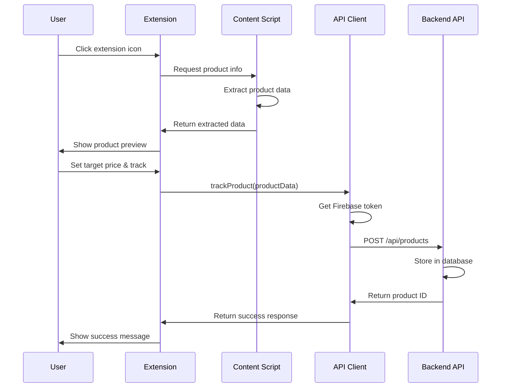
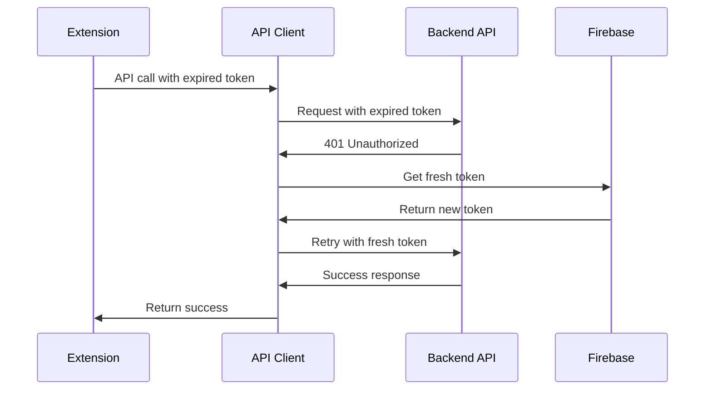

# Chrome Extension API Usage Guide

## Overview

This document explains how the DealPop Chrome Extension uses the backend API to track products, manage user data, and integrate with the DealPop ecosystem.

## API Client Architecture

The extension uses a centralized API client (`src/services/apiClient.ts`) that handles:
- **Authentication**: Firebase JWT token management
- **Request/Response**: Standardized API communication
- **Error Handling**: Automatic retry and token refresh
- **Type Safety**: TypeScript interfaces for all API calls

## Authentication Flow

### Firebase JWT Token Usage
All API calls include Firebase JWT tokens in the Authorization header:

```typescript
// Automatic token inclusion
const headers = {
  'Authorization': `Bearer ${firebaseJWTToken}`,
  'Content-Type': 'application/json'
};
```

### Token Management
- **Storage**: Tokens stored in Chrome's local storage
- **Refresh**: Automatic token refresh before expiration
- **Retry Logic**: API calls retry once with fresh token on 401 errors
- **Error Handling**: Clear error messages for auth failures

## API Endpoints Used by Extension

### 1. Product Tracking

#### POST /api/products - Track New Product
**When Used**: User clicks "Track This Product" in extension popup

**Request Flow**:
```typescript
// 1. Extract product data from page
const productData = extractProductInfo();

// 2. Send to backend
const response = await apiClient.trackProduct({
  productUrl: productData.url,
  productName: productData.title.value,
  productImageUrl: productData.image.value,
  vendor: detectVendor(productData.url),
  currentPrice: parsePrice(productData.price.value),
  targetPrice: userSetTargetPrice,
  expiresAt: calculateExpirationDate()
});
```

**Request Example**:
```json
{
  "productUrl": "https://www.amazon.com/dp/B08N5WRWNW",
  "productName": "Echo Dot (4th Gen) Smart Speaker with Alexa",
  "productImageUrl": "https://m.media-amazon.com/images/I/714Rq4k05UL._AC_SL1000_.jpg",
  "vendor": "Amazon",
  "currentPrice": 49.99,
  "targetPrice": 39.99,
  "expiresAt": "2024-12-31T23:59:59.000Z"
}
```

**Response Handling**:
```typescript
if (response.success) {
  // Show success message to user
  showSuccessMessage("Product tracking started!");
} else {
  // Show error message
  showErrorMessage(response.error);
}
```

#### GET /api/products - Load User's Products
**When Used**: Dashboard loads user's tracked products

**Request Flow**:
```typescript
// Load all tracked products
const response = await apiClient.getTrackedProducts();

if (response.success) {
  // Display products in dashboard
  displayProducts(response.data);
}
```

**Response Example**:
```json
[
  {
    "id": "123e4567-e89b-12d3-a456-426614174000",
    "productUrl": "https://www.amazon.com/dp/B08N5WRWNW",
    "productName": "Echo Dot (4th Gen) Smart Speaker with Alexa",
    "productImageUrl": "https://m.media-amazon.com/images/I/714Rq4k05UL._AC_SL1000_.jpg",
    "vendor": "Amazon",
    "currentPrice": 45.99,
    "targetPrice": 39.99,
    "expiresAt": "2024-12-31T23:59:59.000Z",
    "createdAt": "2024-01-15T10:30:00Z",
    "updatedAt": "2024-01-15T10:30:00Z"
  }
]
```

#### PUT /api/products/:id - Update Product
**When Used**: User modifies target price or expiration date

**Request Flow**:
```typescript
// Update product details
const response = await apiClient.updateProduct(productId, {
  targetPrice: newTargetPrice,
  expiresAt: newExpirationDate
});
```

#### DELETE /api/products/:id - Stop Tracking
**When Used**: User removes product from tracking

**Request Flow**:
```typescript
// Stop tracking product
const response = await apiClient.deleteProduct(productId);

if (response.success) {
  // Remove from UI
  removeProductFromList(productId);
}
```

### 2. Health Check

#### GET /health - API Health Check
**When Used**: Extension startup and periodic health monitoring

**Request Flow**:
```typescript
// Check API health
const response = await apiClient.healthCheck();

if (response.success) {
  console.log('API is healthy:', response.data);
} else {
  console.error('API health check failed:', response.error);
}
```

## Data Flow Examples

### 1. Complete Product Tracking Flow



### 2. Error Handling Flow



## Error Handling

### 1. Network Errors
```typescript
try {
  const response = await apiClient.trackProduct(productData);
  // Handle success
} catch (error) {
  if (error.message.includes('Network')) {
    showErrorMessage('Unable to connect to server. Please check your internet connection.');
  } else {
    showErrorMessage('An unexpected error occurred. Please try again.');
  }
}
```

### 2. Authentication Errors
```typescript
// Automatic token refresh handled by API client
if (response.status === 401) {
  // API client automatically retries with fresh token
  // If still fails, user needs to sign in again
  redirectToSignIn();
}
```

### 3. Validation Errors
```typescript
if (response.status === 400) {
  // Show specific validation error
  showErrorMessage(response.data.error);
}
```

## Configuration

### API Base URL Configuration
**File**: `src/config/api.ts`

```typescript
export const API_CONFIG = {
  BASE_URL: import.meta.env.VITE_API_BASE_URL || 
    (import.meta.env.MODE === 'production' 
      ? 'https://bzu99jbwnr.us-east-2.awsapprunner.com' 
      : 'http://localhost:3000'),
  
  ENDPOINTS: {
    PRODUCTS: {
      TRACK: '/api/products',
      LIST: '/api/products',
      UPDATE: (id: string) => `/api/products/${id}`,
      DELETE: (id: string) => `/api/products/${id}`,
    }
  }
};
```

### Environment Variables
- **Development**: `VITE_API_BASE_URL=http://localhost:3000`
- **Production**: `VITE_API_BASE_URL=https://bzu99jbwnr.us-east-2.awsapprunner.com`

## TypeScript Interfaces

### Product Data Interface
```typescript
export interface ProductData {
  productUrl: string;
  productName: string;
  productImageUrl: string;
  vendor: string;
  currentPrice: number;
  targetPrice: number;
  expiresAt: string;
}
```

### API Response Interface
```typescript
export interface ApiResponse<T = any> {
  success: boolean;
  data?: T;
  error?: string;
  message?: string;
}
```

### Tracked Product Interface
```typescript
export interface TrackedProduct {
  id: string;
  productUrl: string;
  productName: string;
  productImageUrl: string;
  vendor: string;
  currentPrice: number;
  targetPrice: number;
  expiresAt: string;
  createdAt: string;
  updatedAt: string;
}
```

## Performance Considerations

### 1. Request Optimization
- **Debounced Requests**: Prevent rapid-fire API calls
- **Batch Operations**: Group related requests when possible
- **Caching**: Cache product data locally when appropriate

### 2. Error Recovery
- **Retry Logic**: Automatic retry for transient failures
- **Fallback Behavior**: Graceful degradation when API unavailable
- **User Feedback**: Clear error messages and recovery options

### 3. Token Management
- **Proactive Refresh**: Refresh tokens before expiration
- **Storage Efficiency**: Minimal token storage footprint
- **Security**: Secure token storage in Chrome

## Testing API Integration

### 1. Local Development
```bash
# Start backend API locally
cd backend-api
npm run dev

# Update extension config
# Set VITE_API_BASE_URL=http://localhost:3000

# Build and test extension
npm run build
# Load in Chrome and test
```

### 2. API Testing
```typescript
// Test API connectivity
const healthCheck = await apiClient.healthCheck();
console.log('API Health:', healthCheck);

// Test product tracking
const testProduct = {
  productUrl: 'https://example.com/product',
  productName: 'Test Product',
  productImageUrl: 'https://example.com/image.jpg',
  vendor: 'Test Vendor',
  currentPrice: 100.00,
  targetPrice: 80.00,
  expiresAt: new Date(Date.now() + 30 * 24 * 60 * 60 * 1000).toISOString()
};

const response = await apiClient.trackProduct(testProduct);
console.log('Track Product Response:', response);
```

### 3. Error Testing
```typescript
// Test with invalid token
const invalidToken = 'invalid-token';
// Should trigger 401 and retry logic

// Test with network error
// Disconnect internet and make API call
// Should show appropriate error message
```

## Monitoring and Debugging

### 1. Console Logging
```typescript
// API client includes comprehensive logging
console.log('🔍 API request:', endpoint, data);
console.log('✅ API response:', response);
console.log('❌ API error:', error);
```

### 2. Network Tab
- Monitor API calls in Chrome DevTools
- Check request/response headers
- Verify token inclusion
- Monitor response times

### 3. Error Tracking
```typescript
// Track API errors for debugging
if (!response.success) {
  console.error('API Error:', {
    endpoint,
    error: response.error,
    timestamp: new Date().toISOString(),
    userAgent: navigator.userAgent
  });
}
```

## Security Considerations

### 1. Token Security
- **Secure Storage**: Tokens stored in Chrome's secure storage
- **HTTPS Only**: All API calls use HTTPS
- **Token Expiration**: Automatic token refresh
- **No Token Logging**: Tokens never logged to console

### 2. Input Validation
- **Client-side**: Validate data before sending
- **Server-side**: Backend validates all inputs
- **Error Handling**: Don't expose sensitive error details

### 3. CORS Configuration
- **Origin Validation**: Backend validates extension origins
- **Method Restrictions**: Only allow necessary HTTP methods
- **Header Validation**: Validate required headers

---

*This API usage guide focuses on how the Chrome Extension interacts with the backend API. For complete API documentation, see `docs/api/OPENAPI_SPEC.yaml`.*
