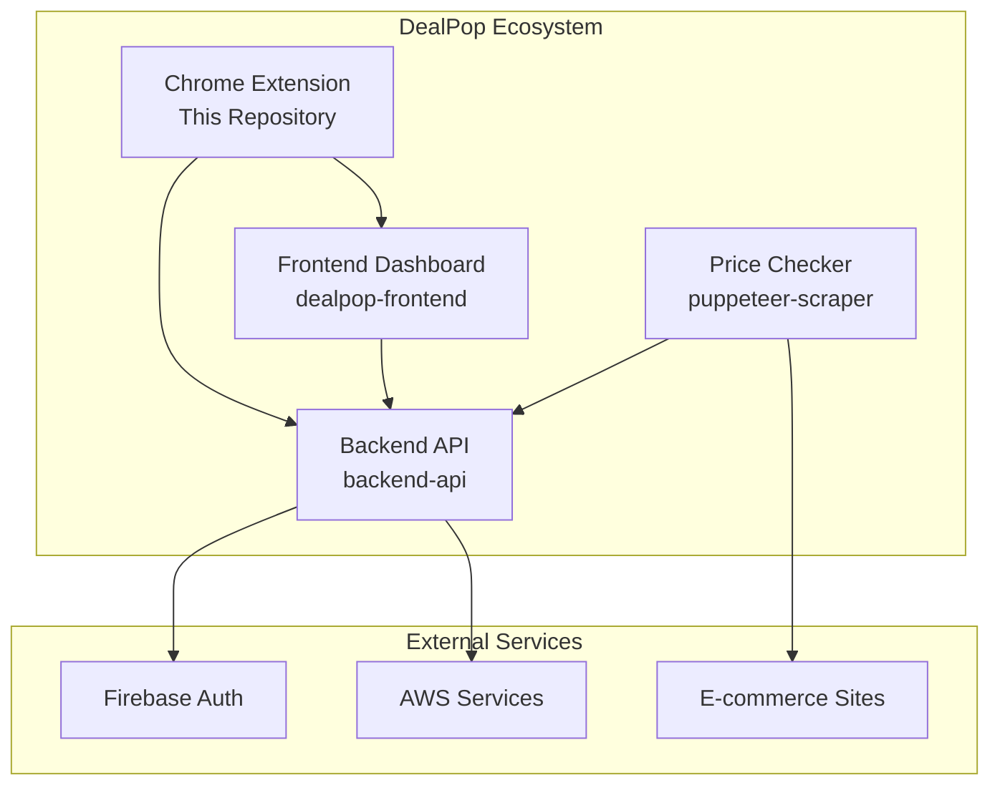
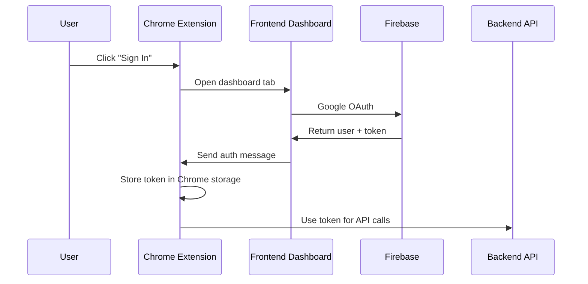
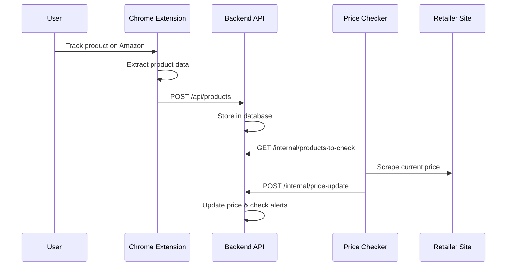
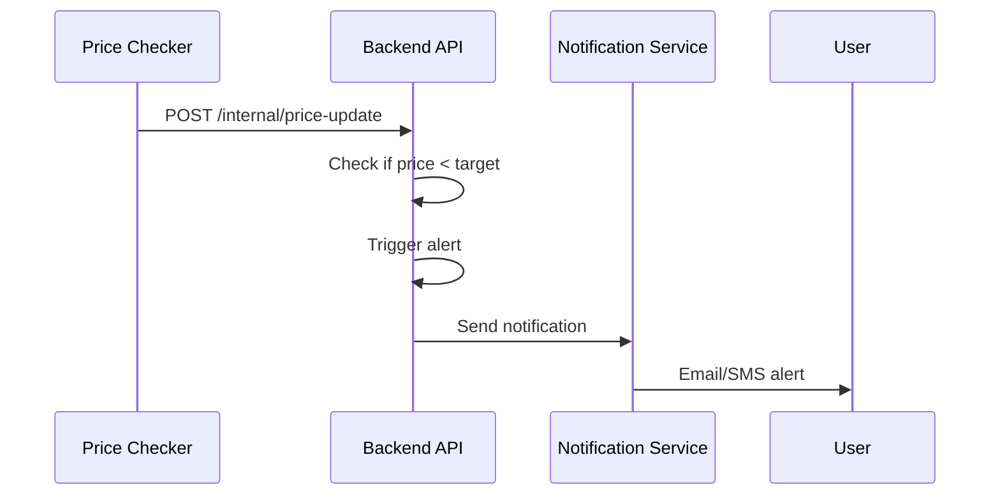

# DealPop Repository Integration Guide

## Overview

The DealPop Chrome Extension is one of four interconnected repositories that work together to provide a complete price tracking solution. This document explains how the Chrome Extension integrates with the other components of the DealPop ecosystem.

## Repository Overview

## Chrome Extension Dependencies

### 1. Backend API Integration
**Repository**: `backend-api`  
**Purpose**: Core data storage and business logic

**What the Extension Depends On**:
- **Product Tracking**: `POST /api/products` - Store tracked products
- **User Authentication**: Firebase JWT token validation
- **Data Retrieval**: `GET /api/products` - Load user's tracked products
- **Product Updates**: `PUT /api/products/:id` - Update product details
- **Product Removal**: `DELETE /api/products/:id` - Stop tracking

**Integration Points**:
- **Authentication**: Extension sends Firebase JWT tokens in Authorization header
- **API Client**: Located in `src/services/apiClient.ts`
- **Configuration**: API endpoints defined in `src/config/api.ts`
- **Error Handling**: Automatic token refresh on 401 errors

**Critical Dependencies**:
- Backend must be deployed and accessible
- CORS must be configured for extension origins
- Firebase project must be consistent across both repos

### 2. Frontend Dashboard Integration
**Repository**: `dealpop-frontend`  
**Purpose**: User authentication and product management interface

**What the Extension Depends On**:
- **Authentication Flow**: Dashboard handles Google OAuth
- **Message Passing**: Chrome runtime messaging for auth data
- **User Experience**: Seamless sign-in experience
- **Extension Communication**: Dashboard sends auth success messages

**Integration Points**:
- **Authentication**: Extension opens dashboard for Google OAuth
- **Message Handling**: Background script receives auth messages
- **Configuration**: Dashboard URL in `src/config/extension.ts`
- **Extension ID**: Must be whitelisted in dashboard's `externally_connectable`

**Critical Dependencies**:
- Dashboard must be deployed and accessible
- Extension ID must match in dashboard configuration
- Message format must be consistent between repos

### 3. Price Checker Service Integration
**Repository**: `puppeteer-scraper`  
**Purpose**: Automated price monitoring and alerting

**What the Extension Enables**:
- **Product Registration**: Products tracked via extension are monitored
- **Price Updates**: Scraper checks prices every 10 minutes
- **Alert System**: Users receive notifications when prices drop
- **Data Flow**: Extension → Backend → Scraper → Backend → User

**Integration Points**:
- **Indirect Integration**: Extension doesn't directly communicate with scraper
- **Data Flow**: Extension creates products → Backend stores → Scraper monitors
- **API Endpoints**: Scraper uses internal API endpoints (`/internal/*`)

**Critical Dependencies**:
- Scraper must be running and calling backend API
- Backend must have internal API endpoints working
- Database must be accessible to both backend and scraper

## Data Flow Between Repositories

### 1. User Authentication Flow

### 2. Product Tracking Flow

### 3. Price Alert Flow

## Configuration Dependencies

### 1. Environment Variables
**Chrome Extension**:
- `VITE_API_BASE_URL`: Backend API URL
- `VITE_DASHBOARD_URL`: Frontend dashboard URL
- `VITE_EXTENSION_DEBUG`: Debug mode flag

**Backend API**:
- `FIREBASE_PROJECT_ID`: Must match extension's Firebase config
- `CORS_ORIGINS`: Must include extension origins
- `INTERNAL_API_KEY`: For scraper authentication

**Frontend Dashboard**:
- `VITE_API_BASE_URL`: Backend API URL
- `VITE_FIREBASE_CONFIG`: Firebase configuration
- Extension ID in `externally_connectable`

**Price Checker**:
- `API_BASE_URL`: Backend API URL
- `INTERNAL_API_KEY`: For API authentication
- `DB_*`: Database connection (if direct access needed)

### 2. Firebase Configuration
All repositories must use the same Firebase project:
- **Project ID**: Must be consistent
- **Authentication**: Google OAuth provider enabled
- **Service Account**: Backend needs service account key
- **Web SDK Config**: Extension and dashboard need web config

### 3. AWS Configuration
- **Region**: All services in `us-east-2`
- **CORS**: Backend must allow extension origins
- **SSL**: All services must use HTTPS
- **Domain**: Consistent domain configuration

## Development Workflow

### 1. Local Development Setup
1. **Start Backend API**: Run backend locally on port 3000
2. **Start Frontend Dashboard**: Run dashboard locally on port 5173
3. **Configure Extension**: Update `src/config/api.ts` for local URLs
4. **Build Extension**: `npm run build` and load in Chrome
5. **Test Integration**: Verify all components communicate

### 2. Testing Integration Points
- **Authentication**: Test sign-in flow end-to-end
- **Product Tracking**: Track product and verify in dashboard
- **Price Updates**: Verify scraper updates prices
- **Error Handling**: Test network failures and token expiration

### 3. Deployment Coordination
- **Backend First**: Deploy backend API
- **Frontend Second**: Deploy dashboard with backend URL
- **Extension Third**: Deploy extension with production URLs
- **Scraper Last**: Deploy scraper with backend URL

## Common Integration Issues

### 1. Authentication Problems
**Symptoms**:
- Extension can't sign in
- Dashboard doesn't send auth message
- API calls return 401 errors

**Solutions**:
- Verify Firebase project consistency
- Check extension ID in dashboard config
- Ensure CORS allows extension origins
- Verify token format and expiration

### 2. API Communication Issues
**Symptoms**:
- Extension can't reach backend
- CORS errors in browser console
- 404 errors for API endpoints

**Solutions**:
- Check backend deployment status
- Verify API URL configuration
- Update CORS settings in backend
- Check network connectivity

### 3. Data Synchronization Issues
**Symptoms**:
- Products not appearing in dashboard
- Price updates not reflecting
- Alerts not triggering

**Solutions**:
- Verify database connectivity
- Check scraper service status
- Monitor backend logs
- Test internal API endpoints

## Monitoring Integration Health

### 1. Health Checks
- **Backend**: `GET /health` endpoint
- **Frontend**: Dashboard accessibility
- **Extension**: Console error monitoring
- **Scraper**: Log monitoring and job status

### 2. Key Metrics
- **API Response Times**: Monitor backend performance
- **Authentication Success Rate**: Track sign-in success
- **Product Tracking Success**: Monitor tracking creation
- **Price Update Frequency**: Verify scraper is running

### 3. Alerting
- **Service Downtime**: Alert on service unavailability
- **High Error Rates**: Monitor API error rates
- **Authentication Failures**: Track auth issues
- **Data Sync Issues**: Monitor data consistency

## Repository-Specific Documentation

### Chrome Extension (This Repository)
- **Architecture**: See `docs/ARCHITECTURE.md`
- **Development**: See `docs/DEVELOPER_SETUP.md`
- **API Usage**: See `docs/integration/API_USAGE.md`
- **Troubleshooting**: See `docs/TROUBLESHOOTING.md`

### Backend API Repository
- **API Documentation**: See `docs/api/OPENAPI_SPEC.yaml`
- **Database Schema**: See backend repository docs
- **Deployment**: See backend repository deployment guides
- **Internal API**: See backend repository for scraper integration

### Frontend Dashboard Repository
- **Setup**: See frontend repository README
- **Extension Integration**: See frontend repository for auth flow
- **Deployment**: See frontend repository deployment guides
- **Configuration**: See frontend repository for environment setup

### Price Checker Repository
- **Scraper Logic**: See scraper repository for extraction logic
- **Scheduling**: See scraper repository for cron configuration
- **Deployment**: See scraper repository for App Runner setup
- **Monitoring**: See scraper repository for logging and alerts

## Best Practices

### 1. Development
- **Version Compatibility**: Keep all repos on compatible versions
- **Environment Consistency**: Use same environment variables across repos
- **Testing**: Test integration points thoroughly
- **Documentation**: Keep integration docs up to date

### 2. Deployment
- **Order Matters**: Deploy in dependency order
- **Health Checks**: Verify each service before deploying next
- **Rollback Plan**: Have rollback procedures for each repo
- **Monitoring**: Monitor integration health post-deployment

### 3. Maintenance
- **Regular Updates**: Keep all repos updated
- **Security Patches**: Apply security updates across all repos
- **Performance Monitoring**: Monitor integration performance
- **Documentation**: Update docs when making changes

---

*This integration guide focuses on how the Chrome Extension integrates with other DealPop repositories. For detailed information about each repository, see their respective documentation.*
